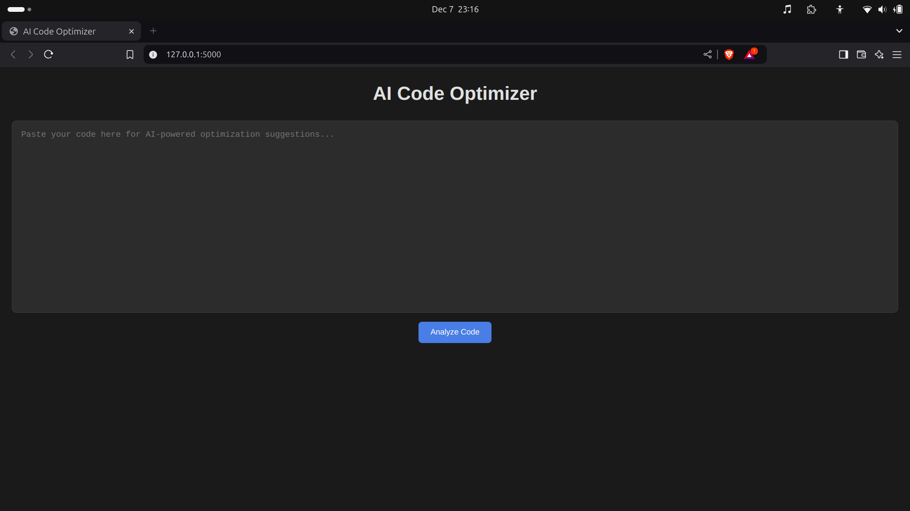
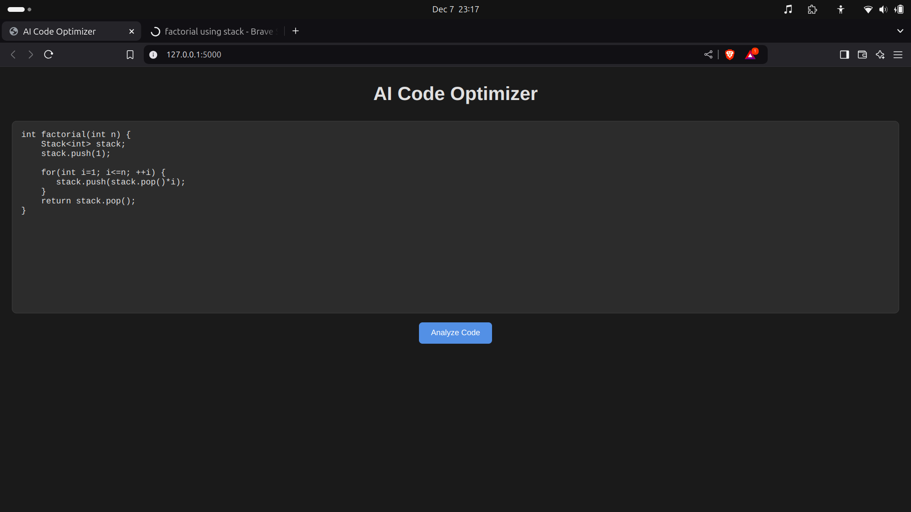
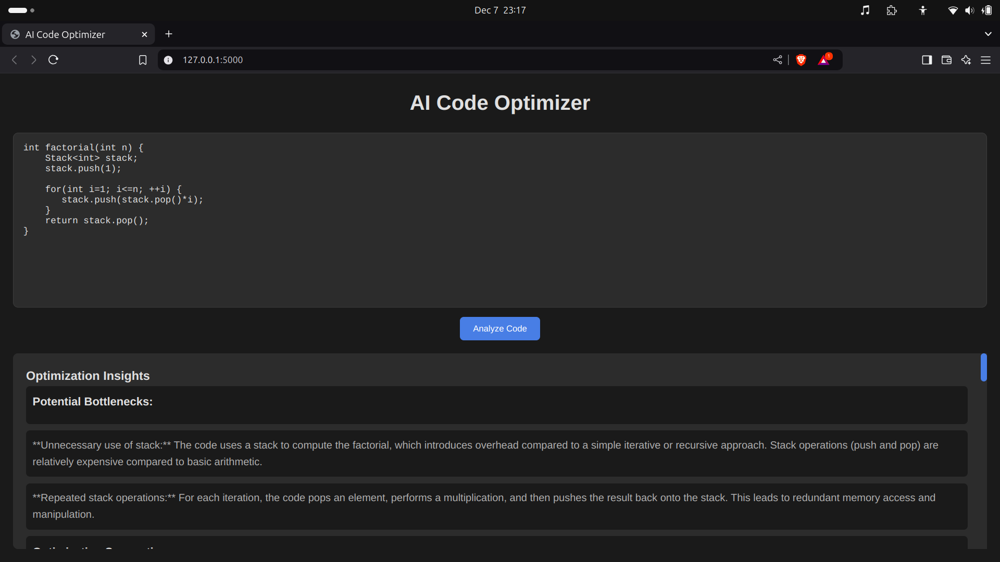

# AI Code Optimizer

An AI-powered tool that analyzes code snippets for performance bottlenecks and provides optimization suggestions. This project demonstrates a simple yet effective web-based application integrating frontend, backend, and AI inference capabilities.

---

## Features
- **Suggestions Block**: Displays general improvement suggestions for the code.
- **Optimizations Block**: Highlights critical optimizations for better performance.
- **Dynamic Output**: Real-time typing animation while showing the results.

---

## Setup Instructions

### 1. Fork the Repository
   - Navigate to the [AI-Code-Optimizer repository](https://github.com/Alan-Saju/AI-Code-Optimizer).
   - Click on the "Fork" button in the upper right corner to create a copy of the repository in your GitHub account.

### 2. Create a Virtual Environment
   - Navigate to the project directory in your local machine:
     ```bash
     cd AI-Code-Optimizer
     ```
   - Create a virtual environment to isolate project dependencies:
     ```bash
     python -m venv env
     ```
   - Activate the virtual environment:
     - On Windows:
       ```bash
       env\Scripts\activate
       ```
     - On macOS and Linux:
       ```bash
       source env/bin/activate
       ```

### 3. Install Requirements
   - With the virtual environment activated, install the required Python packages:
     ```bash
     pip install -r requirements.txt
     ```

### 4. (Optional) Install Frontend Dependencies
   - If your project involves JavaScript or frontend technologies, you may need additional tools:
     ```bash
     npm install
     ```

---

## Running the Project
1. **Run the Backend Server**
   - With the virtual environment activated, start the backend server:
     ```bash
     python app.py
     ```
   - The backend should now be running on `http://localhost:5000`.

2. **Serve the Frontend**
   - Open the `index.html` file directly in a browser, or
   - Serve it using a simple HTTP server:
     ```bash
     python -m http.server 8000
     ```
   - Navigate to `http://localhost:8000` in your browser.

---

## Screenshots

### AI Code Optimizer in Action





---

## License
- This project is licensed under the MIT License. See the [LICENSE](LICENSE) file for more details.

## Acknowledgements
- List any dependencies, libraries, or tools used in this project.

Feel free to reach out if you have any questions or run into issues!
